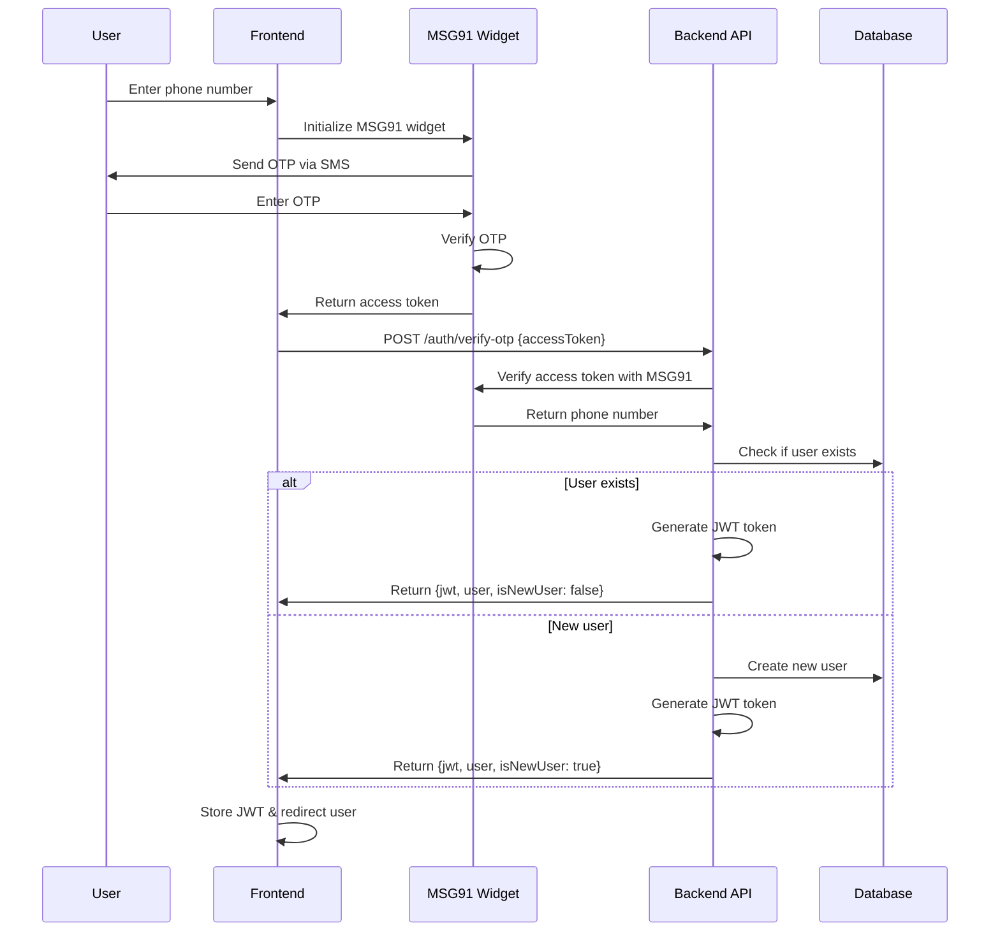

# Authentication System Documentation

## Overview

This application implements a **OTP-based authentication system** using **MSG91** for SMS OTP delivery. The system handles both user registration and login in a **single seamless flow**.

## Architecture

### Key Components

1. **MSG91 Service** (`src/auth/services/msg91.service.ts`)
   - Handles communication with MSG91 API
   - Verifies access tokens from MSG91 widget
   - Extracts phone numbers from verified tokens

2. **Auth Service** (`src/auth/auth.service.ts`)
   - Main authentication business logic
   - Handles user verification and creation
   - Generates JWT tokens
   - Manages login/signup flow

3. **Auth Controller** (`src/auth/auth.controller.ts`)
   - REST API endpoints for authentication
   - `/auth/verify-otp` - Main authentication endpoint
   - `/auth/profile` - Get authenticated user profile

4. **JWT Strategy & Guards**
   - JWT authentication strategy
   - Route protection with guards
   - Role-based access control

## Authentication Flow

### Step-by-Step Process



### Frontend Integration

The frontend receives the MSG91 access token and calls our backend:

```javascript
// From login.html
fetch('http://localhost:3000/api/v1/auth/verify-otp', {
    method: 'POST',
    headers: {
        'Content-Type': 'application/json'
    },
    body: JSON.stringify({ accessToken: accessToken })
})
```

### Backend Response

```json
{
  "message": "Authentication successful",
  "data": {
    "accessToken": "eyJhbGciOiJIUzI1NiIsInR5cCI6IkpXVCJ9...",
    "user": {
      "id": "64f123456789abcdef123456",
      "name": "John Doe",
      "email": "john.doe@example.com",
      "phoneNumber": "+1234567890",
      "role": "USER",
      "isActive": true,
      "createdAt": "2025-09-17T02:30:00.000Z",
      "updatedAt": "2025-09-17T02:35:00.000Z"
    },
    "isNewUser": false
  }
}
```

## Environment Configuration

Required environment variables in `.env`:

```env
# JWT Configuration
JWT_SECRET=Ez-Prep-Super-Secret-JWT-Key-For-Authentication-2025-Should-Be-Long-Enough-For-Security
JWT_EXPIRES_IN=7d

# MSG91 Configuration
MSG91_AUTH_KEY=your-msg91-auth-key-here
```

## API Endpoints

### Authentication Endpoints

#### `POST /api/v1/auth/verify-otp`
- **Purpose**: Verify OTP access token and authenticate user
- **Body**: `{ "accessToken": "token_from_msg91_widget" }`
- **Response**: Authentication response with JWT and user data
- **Handles**: Both login and signup

#### `GET /api/v1/auth/profile`
- **Purpose**: Get current authenticated user profile
- **Auth**: Requires JWT Bearer token
- **Response**: Current user information

### Protected User Endpoints

#### `GET /api/v1/users/me`
- **Purpose**: Get current user profile
- **Auth**: JWT required
- **Response**: Current user data

#### `PATCH /api/v1/users/me`
- **Purpose**: Update current user profile
- **Auth**: JWT required
- **Body**: User update data (prevents updating sensitive fields)

#### `GET /api/v1/users/stats` (Admin only)
- **Purpose**: Get user statistics
- **Auth**: JWT + Admin role required
- **Response**: User count statistics

#### `GET /api/v1/users/with-deleted` (Admin only)
- **Purpose**: Get all users including deleted ones
- **Auth**: JWT + Admin role required
- **Response**: All users data

## Security Features

### JWT Authentication
- Tokens expire in 7 days (configurable)
- Secure token signing with long secret key
- User role and permissions embedded in token

### Route Protection
```typescript
// Require authentication
@UseGuards(JwtAuthGuard)

// Require specific roles
@UseGuards(JwtAuthGuard, RolesGuard)
@Roles(UserRole.ADMIN)
```

### Data Protection
- Sensitive user data excluded from responses
- User profile updates filtered to prevent privilege escalation
- Soft delete system maintains data integrity

## User Management Integration

### Automatic User Creation
When a new phone number is verified:
1. System creates user with temporary name and email
2. User can later update their profile information
3. Phone number serves as primary identifier

### Existing User Login
When an existing phone number is verified:
1. System retrieves user from database
2. Checks if user account is active
3. Returns existing user data with JWT

## Frontend Handling Recommendations

### After Successful Authentication

```javascript
const response = await fetch('/api/v1/auth/verify-otp', {/*...*/});
const { data } = await response.json();

// Store JWT token
localStorage.setItem('authToken', data.accessToken);

// Handle routing based on user type
if (data.isNewUser) {
    // Redirect to profile completion page
    router.push('/complete-profile');
} else {
    // Redirect to dashboard
    router.push('/dashboard');
}
```

### Making Authenticated Requests

```javascript
// Include JWT in requests
const response = await fetch('/api/v1/users/me', {
    headers: {
        'Authorization': `Bearer ${localStorage.getItem('authToken')}`,
        'Content-Type': 'application/json'
    }
});
```

## Error Handling

### Common Error Responses

1. **Invalid Access Token** (401)
   ```json
   {
     "statusCode": 401,
     "message": "Invalid or expired access token"
   }
   ```

2. **Account Deactivated** (401)
   ```json
   {
     "statusCode": 401,
     "message": "Your account has been deactivated. Please contact support."
   }
   ```

3. **Insufficient Permissions** (403)
   ```json
   {
     "statusCode": 403,
     "message": "Insufficient permissions"
   }
   ```

## Testing

### Manual Testing
1. Use the provided `login.html` file
2. Enter a valid phone number
3. Complete OTP verification
4. Check browser console for API responses

### API Testing with Postman/Insomnia
1. Test `/auth/verify-otp` with mock MSG91 tokens
2. Use returned JWT for subsequent requests
3. Test protected endpoints with proper authentication

## Next Steps

1. **Profile Completion Flow**: Guide new users to complete their profiles
2. **Password Reset**: Implement OTP-based password/profile recovery
3. **Session Management**: Add refresh token mechanism
4. **Admin Dashboard**: Create admin interface for user management
5. **Audit Logging**: Track authentication events and user activities

## Security Considerations

1. **Token Storage**: Frontend should use secure storage (httpOnly cookies preferred over localStorage)
2. **HTTPS Only**: Ensure all authentication happens over HTTPS in production
3. **Rate Limiting**: MSG91 requests should be rate-limited to prevent abuse
4. **Token Rotation**: Consider implementing refresh token rotation
5. **Audit Trails**: Log all authentication attempts and failures