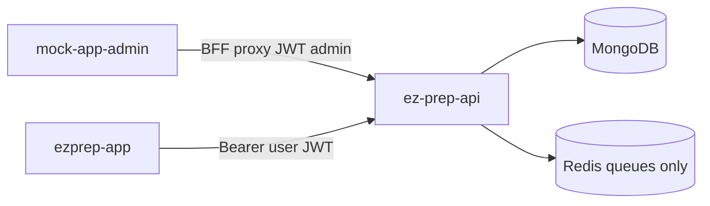

# Current Architecture (Three Repos)

Evidence labels: **[Verified]** / **[Inferred]**. Discovery performed against the three workspace repositories before implementation.

---

## 1. ez-prep-api

### Stack **[Verified]**

- NestJS 11, TypeScript, Node 24
- MongoDB via Mongoose 8
- JWT auth (Passport): student OTP/Google; admin username/password
- Redis + BullMQ for import queues only (`docs/REDIS.md`); `RedisKeyBuilder` ready for future cache keys
- Jest unit tests colocated (`*.spec.ts`); Supertest e2e under `test/`
- Global prefix `api/v1`; Swagger `/api/docs`
- Response shape: `{ message, data, pagination? }`

### Layout **[Verified]**

Feature modules under `src/<feature>/` with `*.module.ts`, `*.controller.ts`, `*.service.ts`, `schemas/`, `dto/`, specs. Shared cross-cutting code in `src/common/` (filters, pipes, enums, guards usage).

Key modules today: `auth`, `users`, `categories`, `exam-groups`, `exams`, `subjects`, `topics`, `tags`, `questions`, `mock-tests`, `full-mock-tests`, `sprint-tests`, `mock-test-attempts`, `admin-users`, `admin-dashboard`, `imports`, `queues`, `redis`, `analytics`, `search`, `current-affairs`, `instance-config`, `aws`.

### Academic hierarchy **[Verified]**

```text
Category
  └── ExamGroup.category → Category
        └── Exam.examGroup → ExamGroup
            Exam.category  → Category   (denormalized; not cross-validated today)
              └── MockTest.exam → Exam   (collection: mocktests)
                    paperType: TOPIC_WISE | FULL_EXAM | SPRINT
```

Full-exam and sprint papers are published into the same `mocktests` collection via dedicated modules.

### Auth and roles **[Verified]**

- Roles: `user` | `admin` only
- Guards: `JwtAuthGuard`, `RolesGuard` + `@Roles(UserRole.ADMIN)`, `OptionalJwtAuthGuard`
- Soft delete via `isDeleted` + Mongoose `pre(/^find/)` on most schemas

### Access control today **[Verified]**

`MockTestAttemptsService.startAttempt`:

1. Validates ObjectId
2. Loads mock test (soft-delete middleware)
3. Requires `isActive`
4. Enforces `allowRetake` / in-progress conflict
5. Creates attempt with frozen paper config

**No entitlement, subscription, or payment check.** Any authenticated user can start any active paper.

### Commerce-related placeholders **[Verified]**

- `User.subscription` embedded: `plan`, `status`, `startedAt`, `expiresAt`, `trialEndsAt`, `autoRenew`
- Admin `PATCH /users/:id/subscription` writes fields only
- Admin dashboard aggregates `byPlan` for reporting
- `membershipTier` is gamification/analytics, not access control
- **No** Product, Offer, Order, Payment, Entitlement, Invoice, Refund, or Razorpay modules in `src/`

### Patterns to reuse **[Verified]**

- Attempt papers freeze config at start (model for commercial snapshots)
- `HttpExceptionFilter` uniform errors
- class-validator DTOs + Swagger
- Instance isolation via env (`INSTANCE_ID`, separate Mongo/Redis)

---

## 2. mock-app-admin

### Stack **[Verified]**

- Next.js App Router (v16), React 19, TypeScript
- Ant Design 5 for admin CRUD; shadcn mostly on login
- Tailwind; local `useState`/`useEffect` (no Redux/React Query)
- Vitest + Testing Library (~87 tests)
- Dev port 3002

### Auth **[Verified]**

- Admin login → httpOnly cookie `ezprep_admin_session`
- `proxy.ts` requires JWT `role === "admin"`
- Browser calls `/api/ezprep/*`; BFF proxy attaches Bearer and allowlists `ALLOWED_V1_ROOTS`

### Features today **[Verified]**

Dashboard, users (+ detail), questions, bulk upload, failed questions, mock/full/sprint tests, current affairs, categories, exam groups, exams, subjects, topics, tags.

**No** products, offers, payments, refunds, invoices, or entitlement management UI.

### Subscription UI today **[Verified]**

Read-only plan/status on user cards and user detail; dashboard `byPlan`. No write UI for commerce.

### CRUD convention **[Verified]**

List page + create form + table; `[id]` edit page; `showConfirmModal` deletes; `formatEzPrepError`; domain modules under `app/services/ezprep-api/`; prefer `/v1/admin/...` for new admin APIs (root `admin` already allowlisted).

---

## 3. ezprep-app

### Stack **[Verified]**

- Next.js 13 App Router, React 18, TypeScript
- Tailwind + shadcn/ui (Radix), lucide-react, Inter, teal brand
- axios client `lib/api/client.ts` with Bearer from cookie/localStorage
- No Redux/React Query; local state dominant
- **No test runner / no `*.test.*` files**; scripts: dev, build, start, lint, typecheck

### Auth **[Verified]**

- MSG91 OTP + Google PKCE
- `middleware.ts` protects `/dashboard*` and `/complete-profile*`
- Token in `localStorage` + non-HttpOnly cookie `authToken`

### Exam / attempt UX **[Verified]**

- `/dashboard` — exams by category
- `/dashboard/exam/[id]` — overview, topic-wise, full mocks, sprint tabs
- Cards use `userAttemptAction`: START / RESUME / RETAKE
- Launch via `useLaunchAttempt` → `POST /mock-test-attempts/start` or resume
- **No lock, price, or entitlement fields** on live list DTOs
- Header/sidebar: “Free Early Access”
- `/dashboard/subscriptions` — Coming Soon placeholder

### Design conventions for commerce UI **[Verified]**

Teal CTAs, white cards, `rounded-xl`, inline red error banners, ComingSoon pattern, study-materials Lock/Unlock as visual precedent (static, not payment-wired).

### Mobile **[Verified]**

Native app is **not** in this repo; specs under `docs/mobile-migration/`. v1 checkout is web-only.

---

## 4. System interaction today



All three share the same API surface with role gates. There is no separate commerce service.
