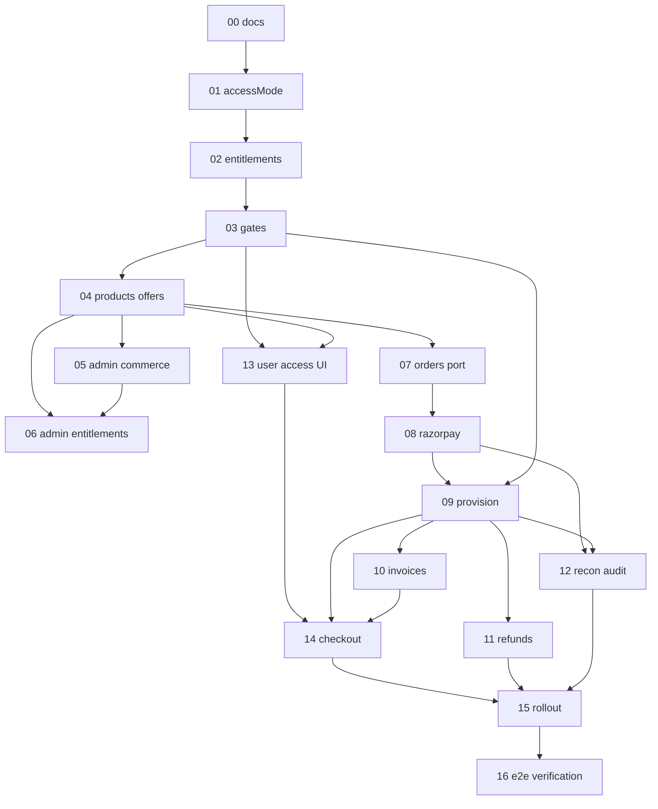

# Implementation Phases

Each phase is independently executable in a **fresh agent session** and ends in a validated, reviewable change set. Do not combine phases.

## Execution model (every session)

1. Read [`../engineering-rules.md`](../engineering-rules.md).
2. Read [`../STATUS.md`](../STATUS.md).
3. Read the phase file.
4. Read only the source files the phase lists.
5. Implement **only** that phase.
6. Validate per the phase’s Tests section + [`../testing-strategy.md`](../testing-strategy.md).
7. Update [`../STATUS.md`](../STATUS.md) (phase board + session log + **developer ops**).
8. Obtain **developer confirmation** in `STATUS.md` before marking the phase `done`.
9. Defer CA/ops items via [`../GOLIVE_TODOS.md`](../GOLIVE_TODOS.md) + `TODO(golive):` — do not stall coding (see D-21).
10. If the phase adds or changes a user-visible flow, append the exact manual UI steps to [`../E2E_TEST_STATUS.md`](../E2E_TEST_STATUS.md). Do not check those boxes. Phase 16 runs the whole board once.

## Phases

| # | Phase | Primary repo(s) | Objective |
| --- | --- | --- | --- |
| 00 | [Foundation docs](phase-00-foundation-docs.md) | docs | Execution pack (done with this folder) |
| 01 | [Access mode and invariants](phase-01-access-mode-and-invariants.md) | api | `accessMode` + FREE script + exam category invariant |
| 02 | [Entitlements + access service](phase-02-entitlements-access-service.md) | api | Entitlement module + AccessControlService + tests |
| 03 | [Enforce access gates](phase-03-enforce-access-gates.md) | api | Wire start/resume + list access DTOs + LEGACY/ENFORCED |
| 04 | [Products + Offers API](phase-04-products-offers-api.md) | api | Commerce catalog APIs + versioning + tests |
| 05 | [Admin commerce UI](phase-05-admin-commerce-ui.md) | admin | Products/Offers CRUD + Vitest |
| 06 | [Admin entitlements UI](phase-06-admin-entitlements-ui.md) | api + admin | Grant/revoke + user entitlements view |
| 07 | [Orders + Payments port](phase-07-orders-payments-port.md) | api | Order/Payment domain + TaxService snapshots + FakeGateway + idempotency |
| 08 | [Razorpay adapter](phase-08-razorpay-adapter.md) | api | Razorpay create/verify/webhook |
| 09 | [Provisioning and stacking](phase-09-provisioning-and-stacking.md) | api | Paid → entitlements idempotent + stack |
| 10 | [GST invoices](phase-10-gst-invoices.md) | api | Tax invoice + PDF + downloads |
| 11 | [Admin refunds](phase-11-admin-refunds.md) | api + admin | Full refund + revoke |
| 12 | [Reconciliation + audit](phase-12-reconciliation-audit.md) | api | Stuck orders worker + commerce audit |
| 13 | [User access UI](phase-13-user-access-ui.md) | app | Locked cards, overview CTA, error mapping |
| 14 | [User checkout + subscriptions](phase-14-user-checkout-subscriptions.md) | app | Checkout + billing + ownership page |
| 15 | [Rollout hardening](phase-15-rollout-hardening.md) | all | ENFORCED, ENTITLED content, hardening checklists |
| 16 | [End-to-end verification](phase-16-end-to-end-verification.md) | all | One UI pass of every phase; last gate before go-live |

## Dependency graph

## Recommended order

`00 → 01 → 02 → 03 → 04 → 05 → 06 → 07 → 08 → 09 → 10 → 11 → 12 → 13 → 14 → 15 → 16`

Phase 16 is the manual UI pass ([`../E2E_TEST_STATUS.md`](../E2E_TEST_STATUS.md)). Do not mark the program live before it is signed.

## Parallelism (optional)

- After **04**: **05** (admin commerce UI) can proceed while **07** (orders port) starts in another track, if API contracts for products/offers are stable.
- **13** (user access UI) can start after **03** + catalog read APIs from **04** (admin grants from **06** enough to test locks without Razorpay).
- **14** needs **09** (+ **10** for invoice links).

## Status

See [`../STATUS.md`](../STATUS.md).
